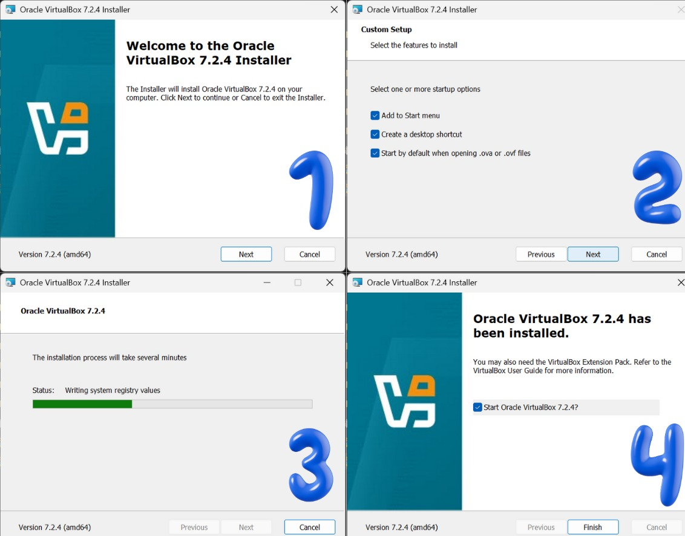

# Laporan Praktikum Minggu [12]
Topik:Virtualisasi Menggunakan Virtual Machine
---

## Identitas
|nama kelompok|nim| kelas|
|------------------|---------------------------|------------------|
|Virli A'inun Subroto| 250202913|1IKRB|
|Syafi'iyah Rahmadani| 250202913|1IKRB|

---

## Tujuan
1. Menginstal perangkat lunak virtualisasi (VirtualBox/VMware).  
2. Membuat dan menjalankan sistem operasi guest di dalam VM.  
3. Mengatur konfigurasi resource VM (CPU, RAM, storage).  
4. Menjelaskan mekanisme proteksi OS melalui virtualisasi.  
5. Menyusun laporan praktikum instalasi dan konfigurasi VM secara sistematis.

---

## Dasar Teori
- Virtualisasi dan Hypervisor: Teknik menjalankan OS Guest di atas OS Host menggunakan Hypervisor (seperti VirtualBox) yang berfungsi mengelola dan mengalokasikan sumber daya perangkat keras fisik ke lingkungan virtual.

- Abstraksi Sumber Daya: Setiap Virtual Machine (VM) memiliki alokasi mandiri untuk CPU, RAM, dan storage, sehingga memungkinkan beberapa OS berjalan secara bersamaan tanpa saling mengganggu kinerja satu sama lain.

- Isolasi dan Keamanan: Virtualisasi menciptakan lingkungan terisolasi (sandboxing) yang melindungi OS Host dari kegagalan atau ancaman keamanan yang terjadi di dalam OS Guest.
---

## Langkah Praktikum
1.  **Instalasi Virtual Machine**
   - Instal VirtualBox atau VMware pada komputer host.  
   - Pastikan fitur virtualisasi (VT-x / AMD-V) aktif di BIOS.

2. **Pembuatan OS Guest**
   - Buat VM baru dan pilih OS guest (misal: Ubuntu Linux).  
   - Atur resource awal:
     - CPU: 1–2 core  
     - RAM: 2–4 GB  
     - Storage: ≥ 20 GB

3. **Instalasi Sistem Operasi**
   - Jalankan proses instalasi OS guest sampai selesai.  
   - Pastikan OS guest dapat login dan berjalan normal.

4. **Konfigurasi Resource**
   - Ubah konfigurasi CPU dan RAM.  
   - Amati perbedaan performa sebelum dan sesudah perubahan resource.

5. **Analisis Proteksi OS**
   - Jelaskan bagaimana VM menyediakan isolasi antara host dan guest.  
   - Kaitkan dengan konsep *sandboxing* dan *hardening* OS.

6. **Dokumentasi**
   - Ambil screenshot setiap tahap penting.  
   - Simpan di folder `screenshots/`.

7. **Commit & Push**
   ```bash
   git add .
   git commit -m "Minggu 12 - Virtual Machine"
   git push origin main
   ```
---

## Kode / Perintah
```
Instalasi Virtual Machine
Konfigurasi Resource VM
Analisis Performa Resource
```
---


## Hasil Eksekusi
Sertakan screenshot hasil percobaan atau diagram:
.

.jpeg)

.jpeg)


---

## Analisis
- Mekanisme Isolasi (Sandboxing)
Berdasarkan hasil praktikum, sistem operasi guest (Ubuntu) berjalan di dalam lingkungan terisolasi yang dikelola oleh VirtualBox sebagai hypervisor.
  - Isolasi Resource: Perubahan aktivitas di dalam Ubuntu, seperti saat membuka Firefox yang meningkatkan penggunaan CPU hingga 92.5%, tidak akan mengganggu stabilitas sistem operasi host. Ini dikarenakan hypervisor membatasi akses guest hanya pada sumber daya yang telah dialokasikan (misal: 2 CPU dan 2.0 GB RAM).

  -  Keamanan (Hardening): Jika terjadi kerusakan sistem atau serangan malware di dalam guest OS, dampak tersebut akan terkurung (sandboxed) di dalam mesin virtual saja, sehingga sistem utama tetap aman.


- ### 2. Analisis Performa Resource

Berdasarkan praktikum yang telah dilakukan, berikut adalah analisis perbandingan penggunaan resource pada Guest OS (Ubuntu) dalam dua kondisi yang berbeda:

#### **Tabel Perbandingan Resource**
| Kondisi Sistem | Penggunaan CPU (Avg) | Penggunaan Memori (RAM) | Status Network (Total Received) |
| :--- | :--- | :--- | :--- |
| **Idle / Standby** | 41.7% | 1.4 GB (70.6%) | 24.0 KB |
| **Beban Tinggi (Buka Firefox)** | 88.6%  | 1.8 GB(89.1%)  | 2.2 MB  |

#### 
1. **Efisiensi CPU**: 
   - Pada saat sistem baru berjalan (idle), penggunaan CPU stabil di kisaran **40%**. 
   - Namun, ketika aplikasi browser Firefox dijalankan, terjadi lonjakan penggunaan CPU hingga mencapai **92.5%** pada core kedua. Hal ini menunjukkan bahwa aplikasi modern memerlukan daya komputasi yang signifikan pada lingkungan virtual.

2. **Manajemen Memori**:
   - Alokasi RAM sebesar **2.0 GB** hampir mencapai batas maksimal (**89.1%**) saat digunakan untuk browsing. 
   - Sistem mulai menggunakan *Cache* sebesar **546.3 MB** untuk menopang performa. Jika penggunaan memori melebihi 2.0 GB, sistem kemungkinan besar akan mengalami *thrashing* atau melambat secara signifikan karena keterbatasan alokasi fisik dari Host OS.

3. **Isolasi Resource**:
   - Meskipun CPU di dalam VM menyentuh angka 90%, mekanisme *Hypervisor* pada VirtualBox memastikan bahwa penggunaan tersebut tetap terisolasi di dalam *container* VM. 
   - Hal ini mencegah Guest OS untuk mengambil seluruh sumber daya CPU milik Host OS secara tidak terkendali, sehingga stabilitas komputer utama tetap terjaga.

4. **Aktivitas Jaringan**:
   - Terjadi peningkatan trafik data yang signifikan dari **24.0 KB** menjadi **2.2 MB** setelah membuka halaman web. Ini membuktikan bahwa kartu jaringan virtual (Virtual Network Adapter) berfungsi dengan baik menjembatani koneksi internet dari Host ke Guest.

---

## Kesimpulan
- Efisiensi Pengelolaan Sumber Daya: Virtualisasi memungkinkan satu perangkat keras fisik (Host OS) menjalankan satu atau lebih sistem operasi tambahan (Guest OS) secara bersamaan melalui manajemen sumber daya (CPU, RAM, dan storage) yang fleksibel oleh hypervisor.

- Keamanan dan Isolasi Sistem: Penggunaan Virtual Machine menciptakan lingkungan yang terisolasi (sandboxing), sehingga aktivitas atau kegagalan yang terjadi pada OS Guest tidak akan memengaruhi stabilitas dan keamanan OS Host.

- Pemahaman Arsitektur Virtualisasi: Praktikum ini berhasil membuktikan peran penting hypervisor dalam menjembatani komunikasi antara perangkat keras fisik dengan berbagai sistem operasi guest yang berbeda.
---

## Quiz
1. Apa perbedaan antara host OS dan guest OS?

| Fitur | Host OS (Sistem Operasi Inang) | Guest OS (Sistem Operasi Tamu) |
| :--- | :--- | :--- |
| **Definisi** | OS yang terinstal langsung pada perangkat keras fisik (*bare-metal*). | OS yang berjalan di dalam mesin virtual (VM). |
| **Akses Hardware** | Memiliki akses langsung dan penuh ke CPU, RAM, dan Disk fisik. | Menggunakan sumber daya virtual yang dijembatani oleh Hypervisor. |
| **Instalasi** | Diinstal pada partisi hard disk fisik. | Diinstal pada file disk virtual (seperti format `.vmdk` atau `.vdi`). |
| **Kemandirian** | Dapat berjalan tanpa perlu software virtualisasi. | Membutuhkan Hypervisor (seperti VirtualBox atau VMware) untuk berjalan. |
| **Contoh** | Windows 11 di laptop Anda. | Linux Ubuntu yang berjalan di dalam VirtualBox. |

2. Apa peran hypervisor dalam virtualisasi?
   1. **Abstraksi (Pemisahan)**
   Menyediakan lapisan antara perangkat keras fisik dan sistem operasi. Hypervisor membuat "perangkat keras palsu" (CPU, RAM, Disk virtual) agar bisa digunakan oleh Guest OS.

   2. **Isolasi (Keamanan)**
   Memastikan setiap Mesin Virtual (VM) berjalan secara mandiri. Jika satu VM mengalami error atau terkena virus, hal tersebut tidak akan menular ke VM lain atau ke sistem fisik.

   3. **Alokasi Sumber Daya**
   Bertindak sebagai manajer yang membagi kapasitas hardware. Contoh: Jika Anda punya RAM 16GB, Hypervisor bisa membagi 4GB untuk Linux, 4GB untuk Windows, dan sisanya untuk Host OS.


3. Mengapa virtualisasi meningkatkan keamanan sistem?  
karena virtualisasi menciptakan jarak antara hardware dan aktivitas user, yang secara signifikan mempersempit celah serangan bagi pihak luar.
---

## Refleksi Diri
Tuliskan secara singkat:
- Apa bagian yang paling menantang minggu ini?  
- Bagaimana cara Anda mengatasinya?  

---

**Credit:**  
_Template laporan praktikum Sistem Operasi (SO-202501) – Universitas Putra Bangsa_
