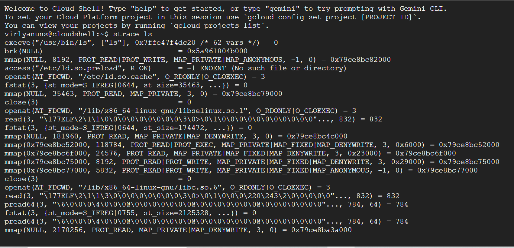
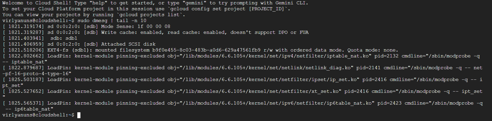
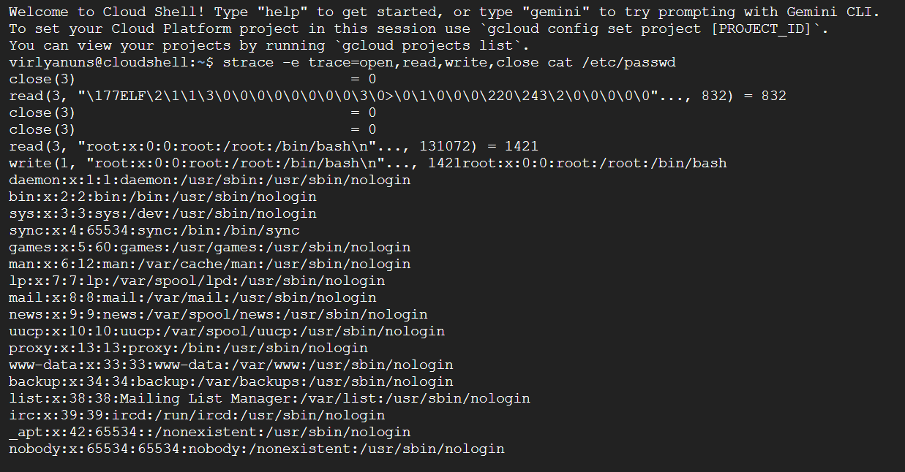

# Laporan Praktikum Minggu [2]
Topik: mekanisme system call dan struktur system operasi
---

## Identitas
- *Nama*  :virli a’inun subroto 
- *NIM*   :250202913 
- *Kelas* :1ikrb 

---

## Tujuan
Tuliskan tujuan praktikum minggu ini:
1. Menjelaskan konsep dan fungsi system call dalam sistem 
   operasi.
2. Mengidentifikasi jenis-jenis system call dan fungsinya.
3. Mengamati alur perpindahan mode user ke kernel saat 
   system call terjadi.
4. Menggunakan perintah Linux untuk menampilkan dan 
   menganalisis system call.

---

## Dasar Teori
Tuliskan ringkasan teori (3–5 poin) yang mendasari percobaan.

---

## Langkah Praktikum
1. Menggunakan aplikasi linux.
2. membuat diagram alur eksekusi system call
3. menjalankan perintah linux `strace ls,strace -e trace=open,read,write,close cat /etc/passwd,dmesg | tail -n 10`
4. lalu screenshot hasil linux
5. menulis ringkasan (400-500 kata) dan mengerjakan kuis
6. lalu push ke github

---

## Kode / Perintah
Tuliskan potongan kode atau perintah utama:
bash
strace ls 
strace -e trace=open,read,write,close cat /etc/passwd 
dmesg | tail -n 10 

---

## Hasil Eksekusi
Sertakan screenshot hasil percobaan atau diagram:

# Eksperimen 1 strace ls
| System call | Keterangan |
| :--- | :---|
|openat | Membuka berbagai berkas pustaka.|
|fstat | Mendapatkan informasi status.|
|mmap | Memetakan berkas pustaka tersebut ke dalam ruang memori program agar dapat digunakan.|
|close |Menutup deskriptor berkas dari pustaka setelah berhasil dimuat.|

# Eksperimen 2 strace -e trace=open,read,write,close cat /etc/passwd
|System call | keterangan|
|  :---| :---|
|openat | pembuka berkas |
| read | membaca data dan berkas |
| write | menulis data ke terminal |
| read |mencari akhir berkas |
| close | menutup berkas|

# Eksperimen 3 dmesg | tail -n 10 
| System call| keterangan |
| :---| :---|
|dmesg |Menampilkan seluruh log pesan yang dihasilkan oleh kernel linux selama proses booting dan selama sistem berjalan.|
|tail -n 10|Menampilkan hanya 10 baris terakhir dari input yang diterima.

---

## Analisis
System call sangat penting untuk keamanan sistem operasi karena merupakan jembatan utama antara aplikasi pengguna dan inti system os. 
System call menyediakan antarmuka yang terkontrol dan terdefinisi dengan baik antara aplikasi pengguna dan kernel sistem operasi yang penting untuk keamanan os. 
 Beberapa alasan mengapa panggilan sistem sangat penting:
-Isolasi dan Pembatasan: Panggilan sistem memungkinkan sistem operasi untuk mengisolasi aplikasi pengguna yang satu denngan yang lainnya. Di mana setiap aplikasi berjalan di ruang pengguna dengan hak istimewa terbatas. 
- Kontrol Akses: Sistem operasi menggunakan panggilan sistem untuk memvalidasi. Ketika suatu aplikasi meminta akses ke sumber daya lainnya, kernel akan memeriksa aplikasi tersebut apakah memiliki izin yang diperlukan. Jika tidak memiliki ijin permintaan akan ditolak, kebijakan ini bertujuan untuk mencegah akses yang tidak sah.
- Mediasi: Mediasi membantu mencegah aplikasi melewati mekanisme keamanan dan mengakses sumber daya secara langsung.
Sistem operasi  memastikan transisi yang aman antara mode pengguna dan mode kernel
 Berikut adalah cara system operasi mengamankan transisi ini:

- Gerbang Panggilan Sistem 
 Gerbang panggilan sistem adalah titik masuk yang terkontrol ke dalam kernel. Mereka adalah lokasi memori yang telah ditentukan yang dikenal oleh perangkat keras, yang memicu interupsi atau pengecualian yang ditangani oleh kernel. Dalam hal keamanan aplikasi biasa tidak bisa langsung menjalankan perintah penting di sistem operasi. Mereka harus melewat gerbang khusus yang disebut gerbang panggilan sistem. sebelum aplikasi tersebut diizinkan masuk dan menjalankan perintah penting. Ini mencegah aplikasi berbahaya merusak sistem.

- Manajemen Hak Istimewa:
Sistem operasi (OS) menggunakan mode hak istimewa untuk membatasi tindakan yang dapat dilakukan oleh kode. Mode pengguna memiliki akses terbatas, tidak dapat langsung mengakses perangkat keras atau memori sistem. Peralihan dari mode pengguna ke mode kernel hanya dapat dilakukan melalui gerbang panggilan system. Kernel akan memeriksa apakah pemanggil memiliki izin yang cukup untuk melakukan operasi yang diminta. 
- Validasi Parameter:
Validasi Parameter Kernel memeriksa semua parameter dari aplikasi pengguna sebelum menjalankan panggilan sistem untuk mencegah data berbahaya atau tidak valid masuk ke kernel.Pengecualian dan interupsi dialihkan ke mode kernel dan ditangani dengan aman untuk mencegah aplikasi berbahaya merusak sistem.
- Penanganan Pengecualian dan Interupsi:
Pengecualian dan interupsi dialihkan ke mode kernel dan ditangani dengan aman untuk mencegah aplikasi berbahaya merusak sistem.

Os memastikan transisi user kernel berjalan aman melalui gerbang (gates) yang mencakup Interupsi dan Pengecualian.
Keamanan transisi ini didasarkan pada empat prinsip :
1.Mode Operasi 
Kernel dan aplikasi berjalan dalam 2 mode operasi yang berbeda:
-Mode Pengguna (User Mode): Program aplikasi berjalan di sini. 
-Mode Kernel (Kernel Mode): Kernel berjalan di sini. 
2.Panggilan Sistem 
3.Mekanisme Gerbang (Gates)
 Transisi tidak terjadi melalui lompatan bebas, tetapi melalui struktur data yang disebut gerbang gates.
4.Validasi Argumen Kernel

 contoh system call yang sering digunakan di Linux:
-Manajemen Berkas
-Manajemen Proses
- Manajemen Memori 
- Jaringan dan Komunikasi

---

## Kesimpulan
Tuliskan 2–3 poin kesimpulan dari praktikum ini.
1.  System Call sebagai Gerbang Keamanan: System call adalah satu-satunya mekanisme yang sah dan aman bagi program user-space untuk mengakses sumber daya penting (I/O, berkas, memori) Kernel. 
2. Kernel Log dan Monitoring: Perintah dmesg memungkinkan pemantauan pesan Kernel secara langsung dari ring buffer Kernel. Hal ini penting untuk mengidentifikasi inisialisasi perangkat keras, driver, dan mendiagnosis error sistem yang terjadi di level paling dasar.
---

## Quiz
1. Apa fungsi utama system call dalam sistem operasi?
System call menyediakan antarmuka yang aman dan terkendali bagi program pengguna untuk meminta layanan dari kernel sistem operasi. Kernel memiliki akses ke hadware dan sumber daya sistem yang dilindungi, dan system call ini memungkinkan untuk program pengguna mengakses sumber daya ini melalui cara yang diawasi dan dikendalikan.

2. Sebutkan 4 kategori system call yang umum digunakan.
Manajemen Proses, Manajemen file, Manajemen Perangkat, Komunikasi

3. Mengapa system call tidak bisa dipanggil langsung oleh user program?
System call tidak bisa dipanggil langsung oleh program pengguna karena alasan keamanan dan integritas sistem. System call memerlukan kode dalam mode kernel

---

## Refleksi Diri
Tuliskan secara singkat:
- Apa bagian yang paling menantang minggu ini?
  menjalankan perintah linux `strace ls,strace -e trace=open,read,write,close cat /etc/passwd,dmesg | tail -n 10`
  serta memahami alur eksekusi system call untuk membuat diagram 
- Bagaimana cara Anda mengatasinya?
belajar dengan  teman yang lebih paham   

---

*Credit:*  
Template laporan praktikum Sistem Operasi (SO-202501) – Universitas Putra Bangsa
