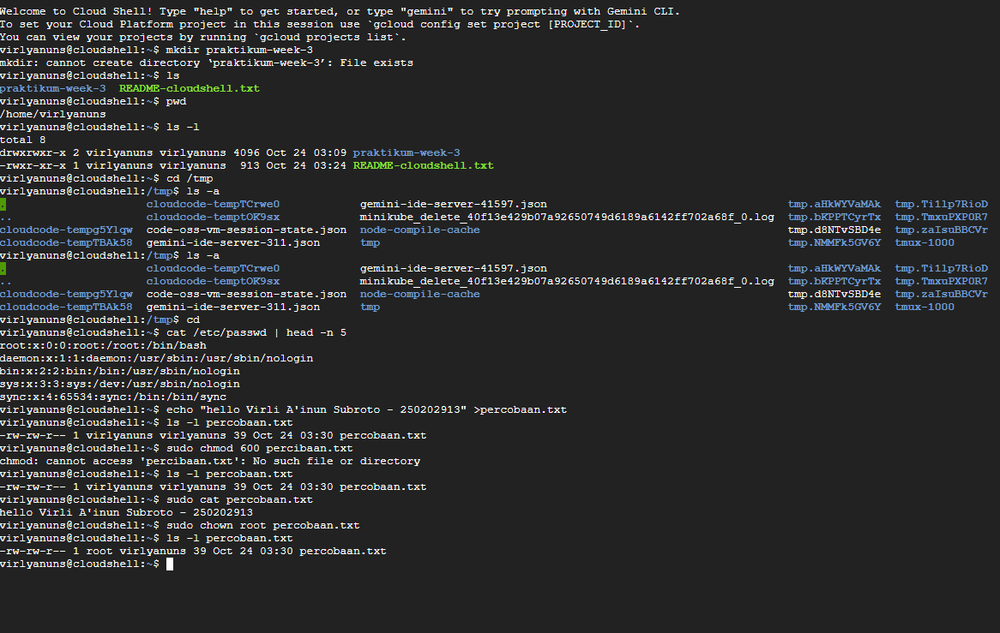

# Laporan Praktikum Minggu 3
Topik: Manajemen File dan Permission di Linux  

---

## Identitas
- **Nama**  :virli a'inun subroto   
- **NIM**   :250202913    
- **Kelas** :1ikrb


---

## Tujuan
Tuliskan tujuan praktikum minggu ini.  
1.Menggunakan perintah ls, pwd, cd, cat untuk navigasi file dan direktori.
2.Menggunakan chmod dan chown untuk manajemen hak akses file.
3.Menjelaskan hasil output dari perintah Linux dasar.
4.Menyusun laporan praktikum dengan struktur yang benar.
5.Mengunggah dokumentasi hasil ke Git Repository tepat waktu.


---

## Dasar Teori
Cara Kerja Sistem File di Linux
Manajemen Hak Akses File Linux menggunakan struktur file berbasis pohon yang dimulai dari direktori root (/), di mana file dan direktori diorganisir secara logis. 
Manajemen Hak Akses File Setiap file di Linux memiliki hak akses yang terdiri dari read (baca), write (tulis), dan execute (eksekusi), yang diberlakukan untuk owner, group , dan others.
Interpretasi Output Perintah Dasar: Perintah Linux menghasilkan output standar yang dapat berupa teks, daftar file, atau pesan error, yang yang berguna untuk membantu pengguna memahami status sistem.


---

## Langkah Praktikum
1. Gunakan Linux (Ubuntu/WSL).
2. Jalankan perintah berikut
pwd ls -l cd /tmp ls -a
cat /etc/passwd | head -n 5
echo "Hello <NAME><NIM>" > percobaan.txt
ls -l percobaan.txt
chmod 600 percobaan.txt
ls -l percobaan.txt
3. lalu screenshot hasil linux
4. mengnalisis hasil percobaan
5. mengerjakan kuis
6. lalu push ke github
---

## Kode / Perintah
Tuliskan potongan kode atau perintah utama:
```bash
pwd
ls -l
cd /tmp
ls -a

cat /etc/passwd | head -n 5

echo "Hello <NAME><NIM>" > percobaan.txt
ls -l percobaan.txt
chmod 600 percobaan.txt
ls -l percobaan.txt
---

## Hasil Eksekusi
Sertakan screenshot hasil percobaan atau diagram:


---

## Analisis
1. pwd:
berfungsi Menampilkan direktori kerja saat ini (jalur lengkap dari direktori tempat shell sedang beroperasi).
ls -lcd /tmp
ls: Perintah untuk membuat daftar isi direktori.
-l: Long format Menampilkan detail seperti hak akses, jumlah hard link, pemilik, grup, ukuran, dan tanggal/waktu.
-c: Menggunakan waktu change (waktu perubahan status terakhir, seperti hak akses) untuk pengurutan, dan menampilkannya sebagai waktu dalam format -l.
-d: (Directory) Memaksa ls untuk menampilkan informasi tentang direktori itu sendiri (/tmp), bukan isinya. Jika opsi ini tidak ada, ls akan menampilkan isi dari /tmp.
/tmp: Target direktori yang informasinya akan ditampilkan.
ls -a
Membuat daftar semua berkas dan direktori, termasuk yang tersembunyi (yang namanya diawali dengan tanda titik, misalnya .bashrc atau . dan ..).


2. - echo "Hello <NAME><NIM>" > percobaan.txt: Membuat atau menimpa berkas percobaan.txt.
- ls -1 percobaan.txt (sebelum chmod): Menampilkan hak akses awal berkas.
-chmod 600 percobaan.txt: Mengubah hak akses berkas menjadi 600.
-ls -l percobaan.txt (Sesudah chmod): Menampilkan hak akses baru berkas, yaitu -rw-------.


---

## Kesimpulan
Tuliskan 2–3 poin kesimpulan dari praktikum ini.
1.Manajemen hak akses file melalui chmod dan chown menunjukkan pentingnya kontrol keamanan, di mana hak akses dapat diatur untuk owner, group, dan others, seperti mengubah file menjadi mode 600 untuk membatasi akses hanya kepada pemilik.
2.Melalui analisis output perintah dan penyusunan laporan, menekankan kemampuan interpretasi hasil eksekusi Linux serta dokumentasi yang tepat waktu ke Git Repository.
3.Secara keseluruhan, praktikum ini membangun fondasi kuat untuk penggunaan Linux dalam tugas sehari-hari, seperti administrasi sistem dan pengembangan perangkat lunak.
---

## Quiz

1.Apa fungsi dari perintah chmod?
 chmod berfungsi untuk mengubah izin akses  pada (file) atau direktori dalam sistem operasi Linux dan sistem operasi berbasis Unix lainnya. Izin akses 
digunakan untuk mengatur izin untuk tiga kategori pengguna:Pemilik ,Grup,Lainnya (Others/World)

2.Apa arti dari kode permission rwxr-xr--?
Rwx :untuk pemilik berkas/user
r (read): Pemilik berkas memiliki izin untuk membaca berkas.
w (write): Pemilik berkas memiliki izin untuk mengubah atau menulis ke berkas.
x (execute): Pemilik berkas memiliki izin untuk menjalankan berkas (jika berkas tersebut adalah program yang dapat dieksekusi) atau masuk ke dalam direktori (jika itu adalah direktori).
r-x:untuk grup
r (read): Anggota grup memiliki izin untuk membaca berkas.
- (no write): Anggota grup tidak memiliki izin untuk mengubah atau menulis ke berkas.
x (execute): Anggota grup memiliki izin untuk menjalankan berkas (jika berkas tersebut adalah program yang dapat dieksekusi) atau masuk ke dalam direktori (jika itu adalah direktori).
r--:untuk lainnya/others
r (read): Pengguna lain (yang bukan pemilik dan bukan anggota grup) memiliki izin untuk membaca berkas.
- (no write): Pengguna lain tidak memiliki izin untuk mengubah atau menulis ke berkas.
- (no execute): Pengguna lain tidak memiliki izin untuk menjalankan berkas atau masuk ke dalam direktori. 

3.Jelaskan perbedaan antara chown dan chmod.
chown: Mengubah kepemilikan berkas atau direktori. dapat mengubah siapa pemilik (user) dan/atau grup dari sebuah berkas.
chmod: Mengubah izin akses (permissions) pada berkas atau direktori serta  menentukan siapa (pemilik, grup, atau lainnya).


---

## Refleksi Diri
Tuliskan secara singkat:
- Apa bagian yang paling menantang minggu ini?
menjalankan perintah pwd
ls -l
cd /tmp
ls -a

cat /etc/passwd | head -n 5

echo "Hello <NAME><NIM>" > percobaan.txt
ls -l percobaan.txt
chmod 600 percobaan.txt
ls -l percobaan.txt  
- Bagaimana cara Anda mengatasinya?
terus mencoba  

---

**Credit:**  
_Template laporan praktikum Sistem Operasi (SO-202501) – Universitas Putra Bangsa_
