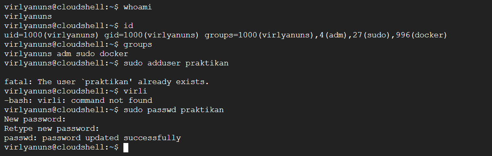
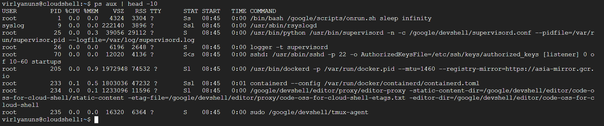
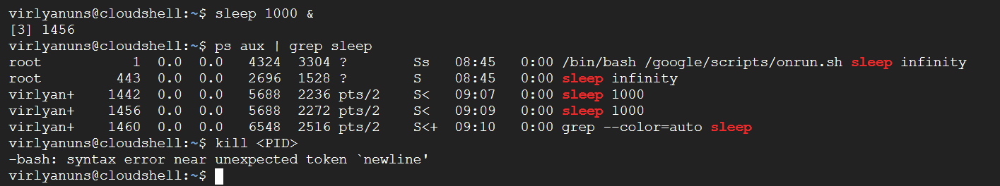
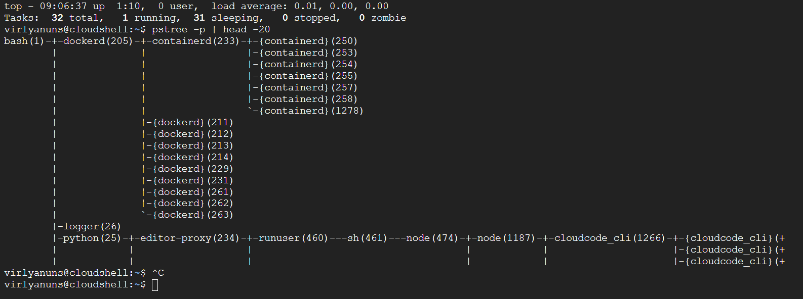

# Laporan Praktikum Minggu 4
Topik: Manajemen Proses dan User di Linux

---

## Identitas
- **Nama**  :virli a'inun subroto   
- **NIM**   :250202913    
- **Kelas** :1ikrb

---

## Tujuan
1. Menjelaskan konsep proses dan user dalam sistem operasi Linux.
2. Menampilkan daftar proses yang sedang berjalan dan statusnya.
3. Menggunakan perintah untuk membuat dan mengelola user.
4. Menghentikan atau mengontrol proses tertentu menggunakan PID.
5. Menjelaskan kaitan antara manajemen user dan keamanan sistem.

---

## Dasar Teori
1. Konsep Proses dan User sebagai   Elemen Dasar Sistem Operasi: Di Linux, proses adalah instansi program yang sedang dieksekusi, dikelola oleh kernel untuk alokasi sumber daya seperti CPU dan memori, dengan setiap proses memiliki Process ID (PID) unik.
2. Manajemen Proses dan User melalui Perintah Sistem: Proses dapat dipantau dengan perintah seperti ps atau top untuk menampilkan daftar proses berjalan beserta statusnya (misalnya, running, sleeping, atau zombie). User dikelola menggunakan perintah seperti useradd, usermod, dan userdel untuk membuat, mengubah, atau menghapus akun, termasuk pengaturan password dan grup.
3. Kaitan Manajemen User dengan Keamanan Sistem: Manajemen user erat terkait keamanan karena membatasi akses melalui mekanisme seperti permission (rwx) pada file dan direktori, serta penggunaan sudo untuk eskalasi hak.

---

## Langkah Praktikum
1. Setup Environment
 - menggunakan Linux (Ubuntu/WSL).
 - memasstikan sudah login sebagai user non-root.
 - Siapkan folder kerja:
`praktikum/week4-proses-user/`

2. Eksperimen 1 – Identitas User Jalankan perintah berikut:

`whoami`
`id`
`groups`
- menjelaskan setiap output dan fungsinya.
- membuat user baru (jika memiliki izin sudo):
`sudo adduser praktikan`
`sudo passwd praktikan`
- Uji login ke user baru.

3. Eksperimen 2 – Monitoring Proses Jalankan:

`ps aux | head -10`
`top -n 1`

- menjelaskan kolom penting seperti PID, USER, %CPU, %MEM, COMMAND.
- menyimpan tangkapan layar top ke:
`praktikum/week4-proses-user/screenshots/top.png`

4. Eksperimen 3 – Kontrol Proses
menjalankan program latar belakang:
`sleep 1000 &
ps aux | grep sleep`
- mencatat PID proses sleep.
- Hentikan proses:
kill <PID>
Pastikan proses telah berhenti dengan ps aux | grep sleep.

5. Eksperimen 4 – Analisis Hierarki Proses Jalankan:

`pstree -p | head -20`
- mengamati hierarki proses dan identifikasi proses induk (init/systemd).
- mencatat hasilnya dalam laporan.

6. Commit & Push

`git add .`
`git commit -m "Minggu 4 - Manajemen Proses & User"`
`git push origin main`

---

## Kode / Perintah
- Hasil observasi seluruh perintah dimasukkan ke dalam laporan.md.
- Screenshot hasil eksekusi disimpan di folder screenshots/.
-Laporan lengkap tersimpan di laporan.md.

- Eksperimen 1`whoami`
`id`
`groups`
`sudo adduser praktikan`
`sudo passwd praktikan`

- Eksperimen 2 `ps aux | head -10`
`top -n 1` mwnyimpan tangkapan layar top ke:`praktikum/week4-proses-user/screenshots/top.png`

- Eksperimen 3 `sleep 1000 &
ps aux | grep sleep`
`kill <PID>` 
- Eksperimen 4 `pstree -p | head -20`

- Commit & Push
`git add `
`git commit -m "Minggu 4 - Manajemen Proses & User"`
`git push origin main`

---

## Hasil Eksekusi
Sertakan screenshot hasil percobaan atau diagram:

.png)

---

## Analisis

    1.Identitas User 
 - whoami Nama pengguna (username) yang sedang aktif.Menunjukkan siapa Anda saat ini. Perintah ini hanya mencetak nama pengguna efektif.
 - id Informasi lengkap tentang identitas pengguna, termasuk UID (User ID), GID (Group ID), dan daftar kelompok yang diikuti.Menampilkan semua detail identitas numerik dan nama dari pengguna yang sedang login.
 - groups Daftar nama-nama kelompok (groups) di mana pengguna saat ini menjadi anggotanya.Menunjukkan kelompok akses apa saja yang dimiliki pengguna, yang menentukan hak akses terhadap file dan sumber daya.

2. Monitoring Proses

 - PID	Process ID Nomor unik untuk mengidentifikasi dan mengendalikan sebuah proses.
 - USER User Name Menunjukkan pemilik proses, penting untuk keamanan dan hak akses.
 - %CPU CPU Usage Persentase waktu CPU yang digunakan, mengukur beban pemrosesan.
 - %MEM	Memory Usage Persentase RAM yang digunakan, mengukur kebutuhan memori.
 - COMMAND Command Line	Nama program yang dijalankan, untuk mengidentifikasi program tersebut.

 3. Kontrol Proses
- Mulai Proses	sleep 1000 & Menjalankan program sleep (1000 detik) di latar belakang.
- Identifikasi PID `ps aux	grep sleep`
- Hentikan Proses kill <PID> Mengirimkan sinyal untuk menghentikan proses berdasarkan PID-nya.
- Verifikasi `ps aux grep sleep`
 
 4. Hierarki Proses
- Proses Induk UtamaProses yang memulai semua proses lain di sistem setelah boot.
- Nama Proses Induksystemd (modern) atau init (lama).
- PID UniversalSelalu memiliki PID 1.
- Fungsi UtamaBertanggung jawab atas inisialisasi sistem (booting) dan mengelola layanan (services).
- Cara MengamatiGunakan perintah seperti pstree atau ps axjf untuk melihat hubungan hirarki proses parent-child.

---

## Kesimpulan
Tuliskan 2–3 poin kesimpulan dari praktikum ini.

1. Kontrol Akses (PoLP): Manajemen pengguna memastikan implementasi Prinsip Hak Akses Terkecil (PoLP), dan setiap pengguna hanya mendapatkan izin minimum yang diperlukan. 

2. Akuntabilitas: Setiap pengguna memiliki UID unik yang digunakan untuk autentikasi dan pencatatan aktivitas. 

3. Pengendalian Hak Istimewa: Penggunaan sudo yang dikelola oleh user management membatasi penggunaan langsung akun root.
---

Tugas & Quiz

## Tugas
1. Dokumentasikan hasil semua perintah dan jelaskan fungsi tiap perintah.
2. Gambarkan hierarki proses dalam bentuk diagram pohon (pstree) di laporan.
[Screenshot hasil](screenshots/Eksperimen3.png)
3. Jelaskan hubungan antara user management dan keamanan sistem Linux.
- Hak Akses & Grup	Menerapkan Prinsip Hak Akses Terkecil (PoLP), meminimalkan kerusakan jika terjadi kompromi akun.
- Autentikasi Unik Memastikan hanya pengguna yang sah yang dapat mengakses sistem dan mencegah akses tidak sah.
- Izin File (UGO)	Mengontrol akses ke data dan konfigurasi sensitif, mencegah modifikasi atau penghapusan berbahaya.
- Akuntabilitas	Setiap tindakan dicatat dan dikaitkan dengan UID tertentu, memungkinkan pelacakan (auditing) insiden keamanan.
- Penggunaan sudo	Membatasi penggunaan akun root secara langsung, memberikan hak istimewa terkontrol, dan mencatat semua perintah administratif.

4. Upload laporan ke repositori Git tepat waktu.

---

## Quiz

1. Apa fungsi dari proses init atau   systemd dalam sistem Linux?
 Proses init adalah proses pertama yang dimulai saat sistem Linux boot, bertugas mengelola startup dan shutdown sistem, serta menjalankan proses-proses lain secara berurutan.
 systemd menggantikan init sebagai sistem inisialisasi yang lebih canggih, yang tidak hanya mengelola proses tetapi juga layanan (services), logging, dan dependensi antar-proses.
2. Apa perbedaan antara kill dan killall?
 kill digunakan untuk menghentikan proses tertentu berdasarkan Process ID (PID).
 killall menghentikan semua proses yang cocok dengan nama tertentu, tanpa perlu PID, seperti killall firefox untuk menghentikan semua instance browser Firefox. 
3. Mengapa user root memiliki hak istimewa di sistem Linux?
 User root adalah superuser dengan akses penuh ke semua file, direktori, dan perintah di sistem, tanpa batasan. untuk administrasi sistem, seperti mengubah konfigurasi kernel, menginstal software, atau memperbaiki masalah kritis.Hak istimewa ini mencegah pengguna biasa merusak sistem secara tidak sengaja, tetapi juga berisiko jika disalah gunakan oleh karena itu, root biasanya digunakan dengan hati-hati atau melalui sudo untuk eskalasi sementara.
 
---

## Refleksi Diri
Tuliskan secara singkat:
- Apa bagian yang paling menantang minggu ini? 
menjalankan perintah 
whoami
id
groups
sudo adduser praktikan
sudo passwd praktikan
ps aux | head -10
top -n 1
sleep 1000 &
ps aux | grep sleep
kill <PID> 
pstree -p | head -20
- Bagaimana cara Anda mengatasinya? 
belajar dan  terus belajar 

---

**Credit:**  
_Template laporan praktikum Sistem Operasi (SO-202501) – Universitas Putra Bangsa_
