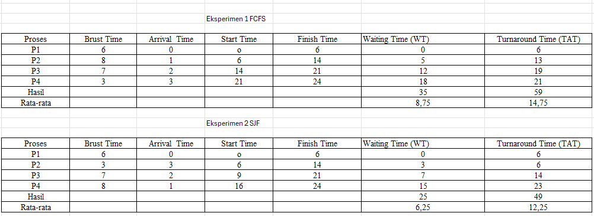

# Laporan Praktikum Minggu [5]
Topik:Penjadwalan CPU – FCFS dan SJF


---

## Identitas
- **Nama**  :virli a'inun subroto   
- **NIM**   :250202913    
- **Kelas** :1ikrb

---

## Tujuan
1. Menghitung waiting time dan turnaround time untuk algoritma FCFS dan SJF.
2. Menyajikan hasil perhitungan dalam tabel yang rapi dan mudah dibaca.
3. Membandingkan performa FCFS dan SJF berdasarkan hasil analisis.
4. Menjelaskan kelebihan dan kekurangan masing-masing algoritma.
5. Menyimpulkan kapan algoritma FCFS atau SJF lebih sesuai digunakan.

---

## Dasar Teori

1. Tujuan Utama Penjadwalan: Memilih proses yang akan dieksekusi CPU untuk memaksimalkan efisiensi dan meminimalkan Waiting Time (waktu menunggu) serta Turnaround Time (total waktu hingga selesai).
2. Kriteria Performa:
- Waiting Time (WT) : Waktu proses berada di antrian siap.
- Turnaround Time(ATT) :Performa diukur dari rata-rata (Average) .
3. FCFS : Algoritma FIFO (Non-Preemptive). Mudah, tapi inefisien karena rentan Convoy Effect (proses pendek menunggu proses panjang), yang meningkatkan rata-rata Waiting Time.

---

## Langkah Praktikum
1. Eksperimen 1 – FCFS (First Come First Served)
- mengurutkan proses berdasarkan Arrival Time.
- menghitung nilai berikut untuk tiap proses:
`Waiting Time (WT) = waktu mulai eksekusi - Arrival Time`
`Turnaround Time (TAT) = WT + Burst Time`
- menghitung rata-rata Waiting Time dan Turnaround Time.
- membuat Gantt Chart sederhana:
`| P1 | P2 | P3 | P4 |`
`0    6    14   21   24`


2. Eksperimen 2 – SJF (Shortest Job First)
- mengurutkan proses berdasarkan Burst Time terpendek (dengan memperhatikan waktu kedatangan).
- melakukan perhitungan WT dan TAT seperti langkah sebelumnya.
- membandingkan hasil FCFS dan SJF pada tabel 

3. Eksperimen 3 – Visualisasi Spreadsheet (Opsional)
- menggunakan Excel/Google Sheets untuk membuat perhitungan otomatis:

   -  Kolom: Arrival, Burst, Start, Waiting, Turnaround, Finish.
   - menggunakan formula dasar penjumlahan/subtraksi.
-  menyimpan screenshot hasil perhitungan dan di:
`praktikum/week5-scheduling-fcfs-sjf/screenshots/`
4. Commit & Push

`git add .`
`git commit -m "Minggu 5 - CPU Scheduling FCFS & SJF"`
`git push origin main`

---

## Kode / Perintah
Tuliskan potongan kode atau perintah utama:
```bash
`Waiting Time (WT) = waktu mulai eksekusi - Arrival Time`
`Turnaround Time (TAT) = WT + Burst Time`
```

---

## Hasil Eksekusi
Sertakan screenshot hasil percobaan atau diagram:



---

## Analisis
1.  Bandingkan hasil rata-rata WT dan TAT antara FCFS & SJF.

    Sesuai tabel yang sudah saya buat, hasil rata-rata WT dan TAT untuk FCFS dan SJF dalam kasus spesifik data adalah
    Rata-rata WT pada SJF (6,25) lebih kecil daripada FCFS (8,75).
    Rata-rata TAT pada SJF (12,25) lebih kecil daripada FCFS (14,75).

2. Jelaskan kondisi kapan SJF lebih unggul dari FCFS dan sebaliknya.
- SJF unggul Ketika:
   - Terdapat Variasi Burst Time yang Signifikan
   - Convoy Effect Dihindari
   - Mode Penjadwalan Preemptive Digunakan

- FCFS unggul Ketika:
    - Implementasi dan Overhead
    - Semua Proses Memiliki Burst Time yang Sama
3. Tambahkan kesimpulan singkat di akhir laporan.

---

## Kesimpulan
1. Performa FCFS dan SJF sangat bergantung pada set data (kombinasi Arrival Time dan Burst Time). Keduanya dapat menghasilkan performa yang sama.

2. FCFS dipilih untuk kesederhanaan (overhead rendah), sementara SJF dipilih untuk efisiensi waktu (WT minimum).

3. FCFS cocok untuk sistem batch sederhana. SJF lebih sesuai untuk sistem yang memprioritaskan respons cepat untuk job pendek, meskipun sulit diimplementasikan di dunia nyata.

---


---

## Quiz
1. Apa perbedaan utama antara FCFS dan SJF?

   - FCFS Proses yang tiba paling awal akan dilayani dan dieksekusi terlebih dahulu.	
   - SJF Proses yang memiliki waktu eksekusi (burst time) CPU terpendek akan dilayani dan dieksekusi terlebih dahulu.

2. Mengapa SJF dapat menghasilkan rata-rata waktu tunggu minimum?

   SJF memprioritaskan penyelesaian pekerjaan sesegera mungkin denagan menerapkan prinsip dasar strategi yang paling efisien untuk meminimalkan penundaan kolektif. 

3. Apa kelemahan SJF jika diterapkan pada sistem interaktif?
   
    waktu respons (response time) yang buruk dan ketidakmampuan untuk memprediksi waktu eksekusi proses secara akurat.
---

## Refleksi Diri
Tuliskan secara singkat:
- Apa bagian yang paling menantang minggu ini? 
menghitung nilai untuk tiap proses:
`Waiting Time (WT) = waktu mulai eksekusi - Arrival Time`
`Turnaround Time (TAT) = WT + Burst Time `
- Bagaimana cara Anda mengatasinya?  
di kerjakan 

---

**Credit:**  
_Template laporan praktikum Sistem Operasi (SO-202501) – Universitas Putra Bangsa_
