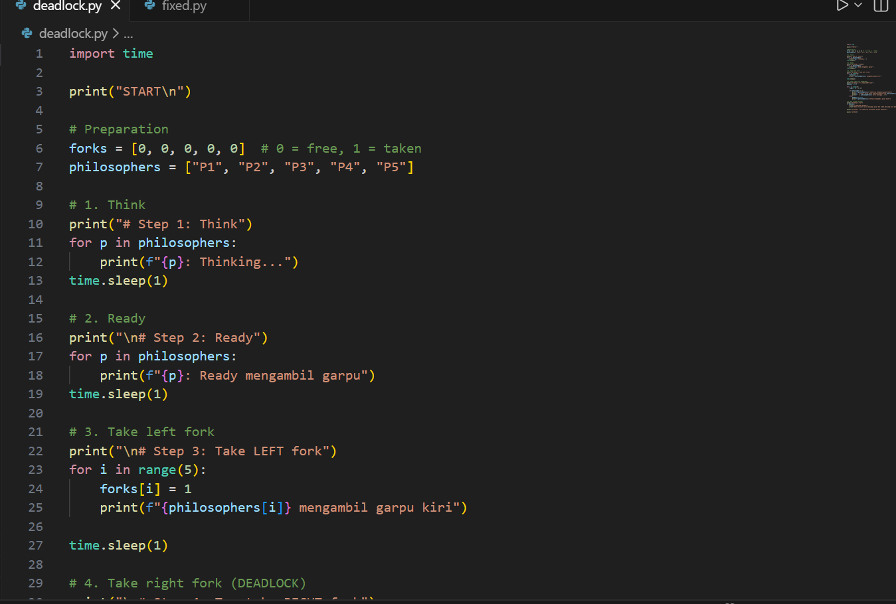
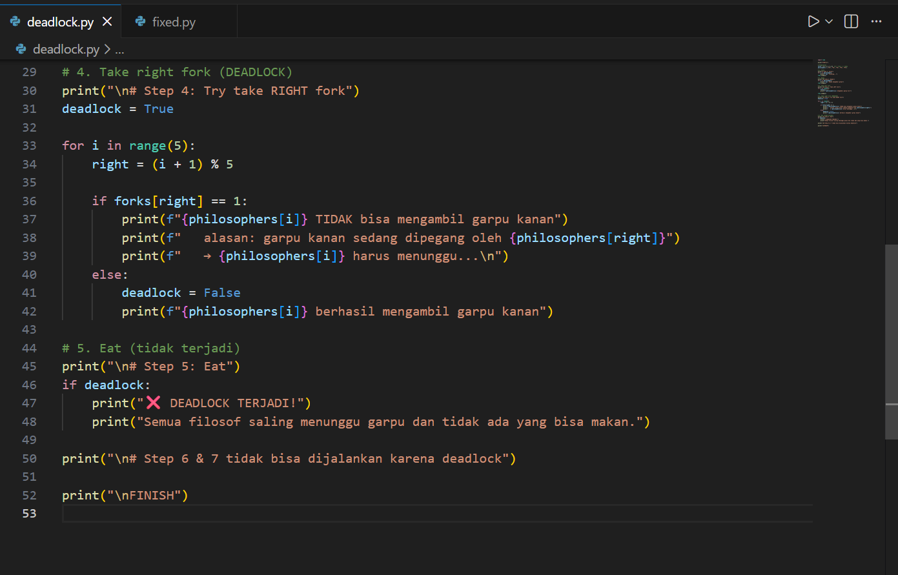
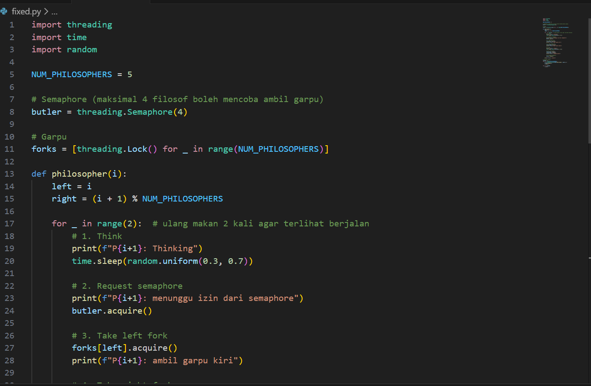
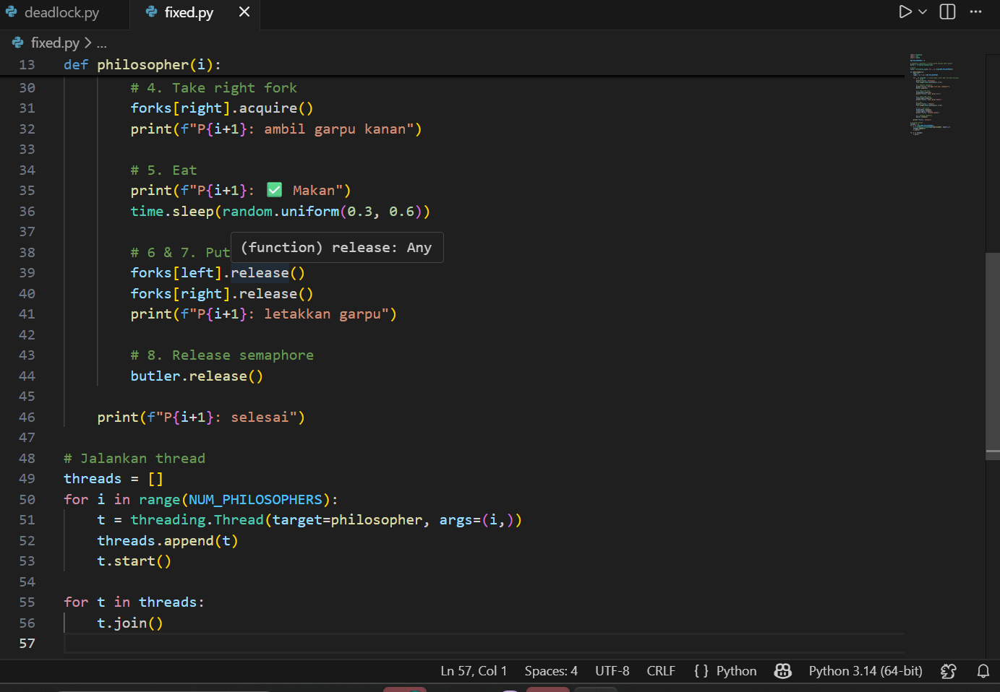

# Laporan Praktikum Minggu 7
## Topik: Sinkronisasi Proses dan Masalah Deadlock


---

## Identitas
|nama kelompok|nim| kelas|
|------------------|---------------------------|------------------|
|Muhamad Juhan | 250202953|1IKRB|
|Virli A'inun Subroto| 250202913|1IKRB|
|Syafi'iyah Rahmadani| 250202913|1IKRB|
---

## Tujuan
 - Memahami konsep dasar sinkronisasi proses dalam sistem operasi.

- Mempelajari penyebab terjadinya deadlock pada proses yang berjalan secara bersamaan.

- Mengidentifikasi empat kondisi deadlock: mutual exclusion, hold and wait, no preemption, dan circular wait.

- Mengimplementasikan solusi sinkronisasi menggunakan semaphore atau monitor pada kasus Dining Philosophers.

- Membandingkan perilaku sistem antara versi yang mengalami deadlock dan versi yang sudah diperbaiki (deadlock-free).

- Meningkatkan kemampuan analisis dan kerja sama tim dalam menyusun laporan eksperimen secara sistematis.


---

## Dasar Teori
- Sinkronisasi Proses
Sinkronisasi proses adalah cara mengatur agar beberapa proses atau thread dapat mengakses data bersama secara aman tanpa menimbulkan konflik.

- Deadlock
Deadlock adalah kondisi ketika beberapa proses saling menunggu sumber daya yang dikunci oleh proses lain sehingga semua proses terhenti.

- Dining Philosophers Problem
Merupakan studi kasus klasik dalam sistem operasi yang menggambarkan bagaimana proses berbagi sumber daya terbatas dan risiko terjadinya deadlock.

- Semaphore dan Monitor
Semaphore dan monitor adalah mekanisme yang digunakan untuk mengontrol akses ke sumber daya bersama agar tidak terjadi deadlock dan konflik data.

---

## Langkah Praktikum
1. Persiapan Tim
- Bentuk kelompok beranggotakan 3–4 orang.
- Tentukan ketua dan pembagian tugas (analisis, implementasi, dokumentasi).
2. Eksperimen 1 – Simulasi Dining Philosophers (Deadlock Version)

- Implementasikan versi sederhana dari masalah Dining Philosophers tanpa mekanisme pencegahan deadlock.
- Contoh pseudocode:
while true:
  think()
  pick_left_fork()
  pick_right_fork()
  eat()
  put_left_fork()
  put_right_fork()
- Jalankan simulasi atau analisis alur (boleh menggunakan pseudocode atau diagram alur).
- Identifikasi kapan dan mengapa deadlock terjadi.

3. Eksperimen 2 – Versi Fixed (Menggunakan Semaphore / Monitor)

- Modifikasi pseudocode agar deadlock tidak terjadi, misalnya:
  - Menggunakan semaphore (mutex) untuk mengontrol akses.
  - Membatasi jumlah filosof yang dapat makan bersamaan (max 4).
  - Mengatur urutan pengambilan garpu (misal, filosof terakhir mengambil secara terbalik).
  - Analisis hasil modifikasi dan buktikan bahwa deadlock telah dihindari.
4. Eksperimen 3 – Analisis Deadlock
-  Jelaskan empat kondisi deadlock dari versi pertama dan bagaimana kondisi tersebut dipecahkan pada versi fixed.
- Sajikan hasil analisis dalam tabel seperti contoh berikut:

 | Kondisi Deadlock | Terjadi di Versi Deadlock | Solusi di Versi Fixed |
 |------------------|---------------------------|------------------------|
 | Mutual Exclusion | Ya (satu garpu hanya satu proses) | Gunakan semaphore untuk kontrol akses |
 | Hold and Wait | Ya | Hindari proses menahan lebih dari satu sumber daya |
 | No Preemption | Ya | Tidak ada mekanisme pelepasan paksa |
 | Circular Wait | Ya | Ubah urutan pengambilan sumber daya |

 5. **Eksperimen 4 – Dokumentasi**
   - Simpan semua diagram, screenshot simulasi, dan hasil diskusi di:
     ```
     praktikum/week7-concurrency-deadlock/screenshots/
     ```
   - Tuliskan laporan kelompok di `laporan.md` (format IMRaD singkat: *Pendahuluan, Metode, Hasil, Analisis, Diskusi*).

6. **Commit & Push**
   ```bash
   git add .
   git commit -m "Minggu 7 - Sinkronisasi Proses & Deadlock"
   git push origin main
   ```


---

## Kode / Perintah
Tuliskan potongan kode atau perintah utama:

``while true:
  think()
  pick_left_fork()
  pick_right_fork()
  eat()
  put_left_fork()
  put_right_fork()``


---

## Hasil Eksekusi
Sertakan screenshot hasil percobaan atau diagram:





---

## Analisis
## Simulasi Dining Philosophers (Deadlock Version)
 Deadlock terjadi karena semua filsuf berhasil mengambil garpu kiri terlebih dahulu, sehingga semua garpu berada dalam kondisi terpakai. Setelah itu, setiap filsuf mencoba mengambil garpu kanan, tetapi garpu tersebut ternyata sedang dipegang oleh filsuf di sebelahnya. Akibatnya, tidak ada satupun filsuf yang bisa melanjutkan proses makan.
Setiap filsuf tetap memegang garpu kiri sambil menunggu garpu kanan menjadi tersedia. Karena tidak ada mekanisme untuk melepaskan garpu yang sudah diambil ketika gagal mengambil garpu kanan, sistem masuk ke kondisi saling menunggu tanpa akhir. Hal inilah yang menyebabkan deadlock pada program.

| Kondisi Deadlock | Terjadi di Versi Deadlock | Solusi di Versi Fixed |
|------------------|---------------------------|------------------------|
| Mutual Exclusion | Ya (satu garpu hanya satu proses) | Gunakan semaphore untuk kontrol akses |
| Hold and Wait | Ya | Hindari proses menahan lebih dari satu sumber daya |
| No Preemption | Ya | Tidak ada mekanisme pelepasan paksa |
| Circular Wait | Ya | Ubah urutan pengambilan sumber daya |


## Versi Fixed

Pada versi fixed, deadlock berhasil dihindari dengan menambahkan semaphore (butler) yang membatasi jumlah filsuf yang boleh mencoba mengambil garpu secara bersamaan. Di dalam kode, semaphore diset hanya mengizinkan 4 filsuf dari 5 untuk masuk ke tahap pengambilan garpu. Hal ini mencegah kondisi di mana semua filsuf memegang satu garpu secara bersamaan.
Selain itu, pada versi ini digunakan threading.Lock() untuk masing-masing garpu sehingga akses ke sumber daya menjadi terkontrol. Jika seorang filsuf sudah selesai makan, dia melepaskan kedua garpu dan juga melepas semaphore, sehingga filsuf lain bisa melanjutkan. Dengan cara ini, siklus tunggu melingkar dihilangkan dan program bisa berjalan sampai semua filsuf selesai makan tanpa macet.

---

## Kesimpulan
1. Program deadlock mengalami kebuntuan karena setiap proses saling menunggu resource yang tidak pernah dilepaskan, sehingga tidak ada proses yang bisa melanjutkan eksekusi.

2. Penyebab utama deadlock adalah pengambilan resource secara bersamaan tanpa pengaturan giliran yang menimbulkan circular wait.

3. Versi fixed berhasil mengatasi deadlock dengan menggunakan semaphore untuk membatasi jumlah proses yang bisa mengakses resource secara bersamaan.

4. Penggunaan mekanisme sinkronisasi seperti lock dan semaphore terbukti efektif untuk mencegah konflik dan kebuntuan pada sistem multitasking.

---

## Quiz
1. Sebutkan empat kondisi utama penyebab deadlock.

   *Jawaban:*. Empat Kondisi Utama Penyebab Deadlock:
- Mutual Exclusion (Saling Pengecualian): Hanya satu proses yang dapat menggunakan sumber daya pada satu waktu.
- Hold and Wait (Tahan dan Tunggu): Proses menahan satu sumber daya sambil menunggu sumber daya lain yang dipegang proses lain.
- No Preemption (Tidak Ada Pemberhentian Paksa): Sumber daya tidak dapat diambil paksa dari proses yang memegangnya.
- Circular Wait (Menunggu Melingkar): Terdapat rantai proses di mana setiap proses menunggu sumber daya yang dipegang oleh proses berikutnya dalam rantai tersebut, dan proses terakhir menunggu yang pertama.
  
2. Mengapa sinkronisasi diperlukan dalam sistem operasi?

   *Jawaban:* Mengapa Sinkronisasi Diperlukan dalam Sistem Operasi?
Sinkronisasi diperlukan untuk mengelola akses bersama ke data dan sumber daya oleh banyak proses atau thread secara bersamaan (konkuren). Tujuannya adalah untuk mencegah Race Condition dan memastikan konsistensi serta integritas data bersama dalam Critical Section.

3. Jelaskan perbedaan antara semaphore dan monitor.

   *Jawaban:*  Perbedaan antara Semaphore dan Monitor:
•	Semaphore: Adalah mekanisme tingkat rendah berupa variabel integer dan dua operasi atomik ($wait$ dan $signal$). Penggunaan semaphore bersifat eksplisit dan rentan kesalahan (programmer harus selalu mengingat untuk memanggil $signal$).
•	Monitor: Adalah konstruksi tingkat tinggi yang menjamin Mutual Exclusion secara implisit (otomatis). Monitor lebih aman dan mudah digunakan karena sistem operasi/kompiler mengelola detail sinkronisasi, dan hanya satu proses yang diizinkan aktif di dalamnya pada satu waktu.


---

## Refleksi Diri
Tuliskan secara singkat:
- Apa bagian yang paling menantang minggu ini?
 menjalanka perintah while true:
  ``think()
  pick_left_fork()
  pick_right_fork()
  eat()
  put_left_fork()
  put_right_fork()``
- Bagaimana cara Anda mengatasinya?  
kerja tim
---

**Credit:**  
_Template laporan praktikum Sistem Operasi (SO-202501) – Universitas Putra Bangsa_
