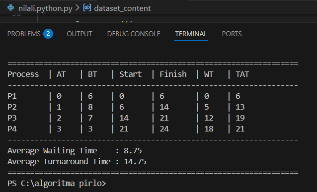

# Laporan Praktikum Minggu [X]
# Topik:Simulasi Algoritma Penjadwalan CPU #


---

## Identitas
- **Nama**  :virli a'inun subroto   
- **NIM**   :250202913    
- **Kelas** :1ikrb
---

## Tujuan
1. Membuat kode program simulasi penjadwalan CPU (FCFS atau SJF).
2. Menjalankan program menggunakan dataset yang telah ditentukan (P1–P4).
3. Menampilkan hasil perhitungan dalam format tabel atau grafik
4. Menyusun penjelasan tertulis mengenai alur dan hasil simulasi.


---

## Dasar Teori
1. Definisi Penjadwalan CPU
- Penjadwalan CPU adalah proses yang menentukan proses mana dalam antrean ready yang akan dialokasikan ke CPU untuk dieksekusi. 

2. Parameter Perhitungan Kinerja
- Arrival Time (AT): Waktu saat proses masuk ke dalam antrean
- Burst Time (BT): Durasi waktu yang dibutuhkan proses untuk dieksekusi oleh CPU
- Waiting Time (WT): Selisih antara waktu mulai eksekusi dengan waktu kedatangan.
- Turnaround Time (TAT): Total waktu yang dihabiskan proses sejak datang hingga selesai. Rumusnya adalah TAT = Finish\_Time - Arrival\_Time

3. Logika Pemrograman Simulasi
- Manajemen Data: Penggunaan modul csv memungkinkan penyimpanan dataset secara terstruktur sehingga memudahkan pengujian ulang dengan data yang berbeda.
- Penanganan Waktu Luang (Idle): Kode program menyertakan logika if current_time untuk menangani kondisi di mana CPU harus menunggu jika belum ada proses yang tiba di antrean.
- Akumulasi Rata-rata: Efisiensi sistem secara keseluruhan dihitung dengan merata-ratakan WT dan TAT dari seluruh proses yang ada.
4. Analisis Hasil Berdasarkan Data
- Proses P1 yang datang pertama kali (AT 0) memiliki waktu tunggu sebesar 0.
- Semakin lama sebuah proses mengantre di belakang proses dengan Burst Time yang besar, maka Waiting Time-nya akan semakin tinggi (seperti P4 dengan WT 18).
- Rata-rata waktu tunggu yang dihasilkan adalah 8.75 dan rata-rata waktu putar (Turnaround Time) adalah 14.75.
---

## Langkah Praktikum
1. **Menyiapkan Dataset**

   Buat dataset proses minimal berisi:

   | Proses | Arrival Time | Burst Time |
   |:--:|:--:|:--:|
   | P1 | 0 | 6 |
   | P2 | 1 | 8 |
   | P3 | 2 | 7 |
   | P4 | 3 | 3 |

2. **Implementasi Algoritma**

   Program harus:
   - Menghitung *waiting time* dan *turnaround time*.  
   - Mendukung minimal **1 algoritma (FCFS atau SJF non-preemptive)**.  
   - Menampilkan hasil dalam tabel.

3. **Eksekusi & Validasi**

   - Jalankan program menggunakan dataset uji.  
   - Pastikan hasil sesuai dengan perhitungan manual minggu sebelumnya.  
   - Simpan hasil eksekusi (screenshot).

4. **Analisis**

   - Jelaskan alur program.  
   - Bandingkan hasil simulasi dengan perhitungan manual.  
   - Jelaskan kelebihan dan keterbatasan simulasi.

5. **Commit & Push**

   ```bash
   git add .
   git commit -m "Minggu 9 - Simulasi Scheduling CPU"
   git push origin main
   ```

---

## Kode / Perintah
Tuliskan potongan kode atau perintah utama:
```bash
dataset_content = [
    ["Process", "ArrivalTime", "BurstTime"],
    ["P1", 0, 6],
    ["P2", 1, 8],
    ["P3", 2, 7],
    ["P4", 3, 3]
] [cite: 1]
```

---

## Hasil Eksekusi
Sertakan screenshot hasil percobaan atau diagram:
.png)
.png)

---

## Analisis
1. Alur Kerja Program
Program memproses dataset yang berisi Arrival Time (waktu kedatangan) dan Burst Time (durasi eksekusi) dari setiap proses.
- Program terlebih dahulu mengurutkan data berdasarkan waktu kedatangan terkecil.
- Pada algoritma FCFS, CPU melayani proses pertama (P1) hingga selesai, kemudian melanjutkan ke proses berikutnya tanpa interupsi (non-preemptive).
- Waktu tunggu (Waiting Time) dihitung berdasarkan selisih antara waktu mulai eksekusi dengan waktu kedatangan proses tersebut.

2. Perbandingan dengan Perhitungan Manual
Berdasarkan hasil eksekusi program terhadap dataset uji:

- Hasil perhitungan otomatis menunjukkan rata-rata Waiting Time sebesar 8.75 dan Turnaround Time sebesar 14.75.

- Hasil ini sepenuhnya konsisten dan sesuai dengan perhitungan manual yang dilakukan pada pertemuan sebelumnya.

- Hal ini memvalidasi bahwa logika algoritma yang diimplementasikan ke dalam kode sudah akurat.

3. Kelebihan dan Keterbatasan Simulasi
- Kelebihan: Simulasi ini memungkinkan pengolahan data dalam jumlah besar secara instan dan meminimalkan risiko kesalahan hitung manusia (human error).

- Keterbatasan: Simulasi ini bersifat sederhana dan berbasis terminal, sehingga belum mempertimbangkan overhead sistem operasi yang nyata seperti waktu untuk context switching antar proses.

---

## Kesimpulan
- Praktikum ini berhasil menjembatani pemahaman teori penjadwalan CPU dengan praktik pemrograman.
 
 - Simulasi menunjukkan bahwa meskipun FCFS mudah diimplementasikan, waktu tunggu dapat membengkak (efek konvoi) jika proses awal memiliki burst time yang besar.
 - memungkinkan pengujian dataset dalam skala besar dengan tingkat akurasi yang tetap terjaga, menghindari risiko kesalahan hitung

---

## Quiz
1. Mengapa simulasi diperlukan untuk menguji algoritma scheduling?
- karena lingkungan sistem operasi yang asli sangat kompleks. Dengan simulasi, kita bisa memprediksi performa algoritma (seperti efisiensi CPU dan waktu tunggu) dalam berbagai skenario tanpa harus mengganggu operasional sistem yang sebenarnya.

2. Apa perbedaan hasil simulasi dengan perhitungan manual jika dataset besar?
- Pada dataset besar, perhitungan manual sangat rentan terhadap human error (salah hitung) dan memakan waktu sangat lama. Simulasi komputer memberikan akurasi matematis yang konsisten dan kecepatan eksekusi yang stabil terlepas dari jumlah datanya.

3. Algoritma mana yang lebih mudah diimplementasikan? 
- FCFS (First-Come, First-Served) adalah yang paling mudah diimplementasikan karena logikanya hanya menggunakan struktur data antrean (Queue) sederhana berdasarkan waktu kedatangan, tanpa perlu melakukan pemilahan ulang (sorting) burst time setiap kali ada proses baru masuk (seperti pada SJF).


---

## Refleksi Diri
Tuliskan secara singkat:
- Apa bagian yang paling menantang minggu ini? 
pemahaman instruksi atau perintah yang diberikan dalam modul.
- Bagaimana cara Anda mengatasinya?  
berdiskusi dengan teman 

---

**Credit:**  
_Template laporan praktikum Sistem Operasi (SO-202501) – Universitas Putra Bangsa_
